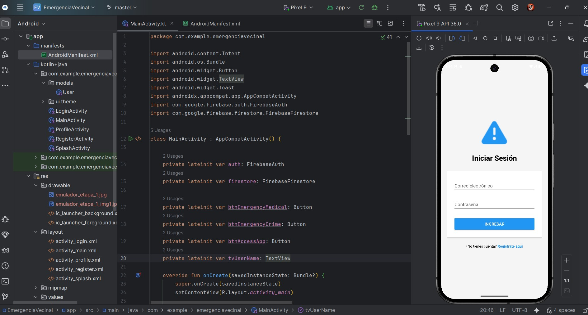

**_<h1 align="center">:vulcan_salute: Proyecto Realizado con Andoid Studio :computer:</h1>_**

**<h3>:blue_book: Contexto de la Actividad:</h3>**

<p>Este ejercicio es la continuación del ejercicio grupal del día anterior.</p>
<p>Una empresa de asesorías en prevención de riesgos necesita contar con un sistema de información que le permita administrar los principales procesos que se llevan a cabo en ella día a día.</p>
<p>Hasta antes de la última reunión del equipo de proyecto, el modelo de datos se veía de la siguiente manera:</p>


**<h3>:orange_book: Requerimiento:</h3>**

<p>Se solicita que desarrolle un conjunto de sentencias SQL que permita pasar desde el modelo de datos original al modelo de datos actualizado, utilizando las consultas vistas en la clase. No es necesario que sea solo una consulta, lo puede hacer en base a una transacción que tenga un inicio y fin determinados, con consultas independientes, pero que forman parte de un conjunto mayor de instrucciones.</p>
<p>Considere que se piden solo las consultas de actualización, no el modelo completo.</p>
<p><b>Nota:</b> No se permite la eliminación y posterior creación de tablas; puede eliminar o modificar campos de una tabla.</p>

**<h3>:book: Link a video en Youtube que muestra proyecto ejecutado:</h3>**

<p align="center">
  <a href="https://www.youtube.com/watch?v=6VQe9vkByBM" target="_blank" style="display:inline-block; padding:10px 20px; background:#ff0000; color:white; border-radius:8px; text-decoration:none; font-weight:bold;">
    ▶️ Ver en YouTube
  </a>
</p>

**<h3>📁 Estructura del Proyecto Android:</h3>**

Leyenda rápida

📁 carpeta
🟧 HTML
🟦 CSS
🟨 JavaScript
🟩 JSON
🖼️ imagen
📘 Markdown

```Android
📘 README.md
📁 app/src/main/
├── 🟧 AndroidManifest.xml
├── 📁 java
│   ├── 📁 com.example.holamundo
│   │   ├── 📁 ui
│   │   │   └── 📁 theme
│   │   │    ├── 🟦 Color.kt
│   │   │    ├── 🟦 Theme.kt
│   │   │    └── 🟦 Type.kt
|   |   ├── 🟦 DeveloperProfile.kt
|   |   ├── 🟦 KotlinFeaturesDemo.kt
│   │   └── 🟦 MainActivity.kt
│   ├── 📁 com.example.holamundo (android Test)
│   │   └── 🟦 ExampleInstrumentedTest.java
│   └── 📁 com.example.holamundo (test)
│       └── 🟦 ExampleUnitTest.java
├── 📁 java (generated)
├── 📁 res
│   ├── 📁 drawable
│   │   │    ├── 🖼️ hello_world_cellphone.png
│   │   │    ├── 🖼️ image_project.jpg
│   │   │    ├── 🖼️ world.jpg
│   │   │    ├── 🟧 ic_launcher_background.xml
│   │   │    └── 🟧 ic_launcher_foreground.xml
│   ├── 📁 layout
│   │   └── 🟧 activity_main.xml
│   ├── 📁 mipmap
│   │   ├── 📁 ic_launcher
│   │   └── 📁 ic_launcher_round
│   ├── 📁 values
│   │   ├── 📁themes
│   │   │   ├── 🟧 themes.xml
│   │   │   └── 🟧 themes.xml (night)
│   │   ├── 🟧 colors.xml
│   │   └── 🟧 strings.xml
│   └── 📁 xml
📁 Gradle Scripts
├── 🟦 build.gradle.kts (Project: HolaMundo)
├── 🟦 build.gradle.kts (Module: app)
├── 🟦 proguard-rules.pro (ProGuard rules for ":app")
├── 🟦 gradle.properties (Project properties)
├── 🟦 gradle-wrapper.properties (Gradle Version)
├── 🟦 libs.versions.toml (version Catalog "libs")
├── 🟦 local.properties (SDK Location)
└── 🟦 settings.gradle.kts (Project Settings)
```

**<h3>:book: Imagen general del proyecto:</h3>**



**<h3>:book: Capturas de pantalla de la interfaz de usuario final:</h3>**

